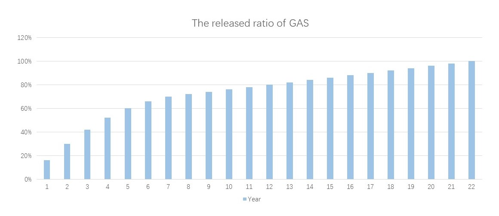

# NEO Token Models

### Native Token

There are 2 kinds of native token defined in Neo system: NEO and NeoGas (GAS).

NEO is the Governing Token. Neo holders can participate in Neo network management, including voting for consensus nodes, network parameter modification, etc. The total amount of NEO is 100 million. Its minimum unit is 1 and can not be divided. It's registered in Genesis block, and stored in standby validators' muti-signature addresses.

GAS is the Utility Token, or network fuel token. Operation costs and incentives for consensus node in Neo network are paid in GAS. The total amount of GAS is also 100 million and can be divided to minimum unit 0.00000001. Gas is registered in Genesis block and issued afterwards as block incentives for NEO holders.

A new block is generated about every 15 seconds according to system design. Thus approximately 2 million new blocks are created every year. 100 million GAS is issued gradually in 22 years according to a attenuation algorithm. No GAS is issued afterwards.

| Cycle |  Block Height Range | Block excitation GAS  |
|-----|-------------     |---------------|
| 1   |0 - (200W -1)     |    8          |
| 2   |200W ~ (400W -1)  |    7          |
| 3   |400W ~ (600W -1)  |    6          |
| 4   |600W ~ (800W -1)  |    5          |
| 5   |800W ~ (1000W -1) |    4          |
| 6   |1000W ~ (1200W -1)|    3          |
| 7   |1200W ~ (1400W -1)|    2          |
|8~22 |1400W ~ (4600W -1)|    1          |
|23~  |4600W ~           |    0          |

### NEP5 Assets (Tokens)

NEP5 tokens need to be issued and managed through smart contract. Their information is stored in a smart contract's storage. Account model is used. For detailed inforamtion, please refer to `NEP5` part in chapter `Smart Contract`.
